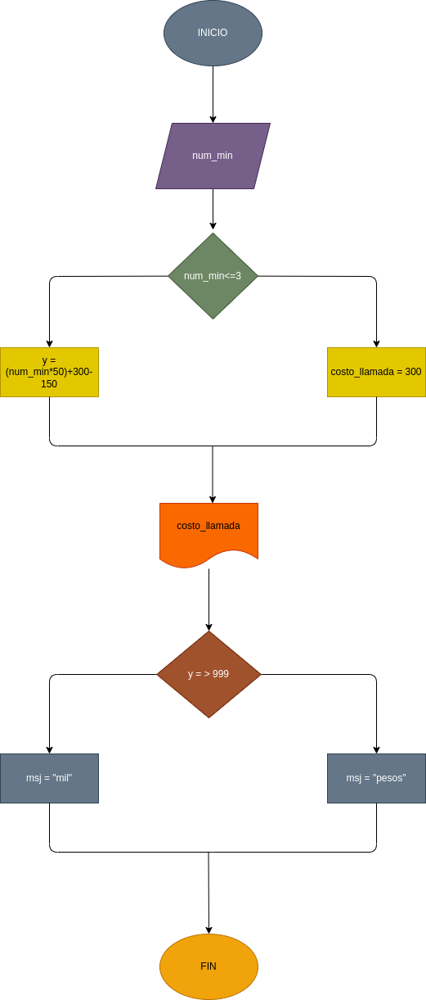

# llamada_telefonica
Programa para calcular el costo de una llamada telefonica

Ingresar el tiempo de duracion de una llamada telefonica y determinar la cantidad a pagar, de acuerdo con lo siguiente:
- toda llamada que dure 3 minutos o menos tiene un costo de 300$
- cada minuto dicional cuesta 50$

# Diagrama de flujo
